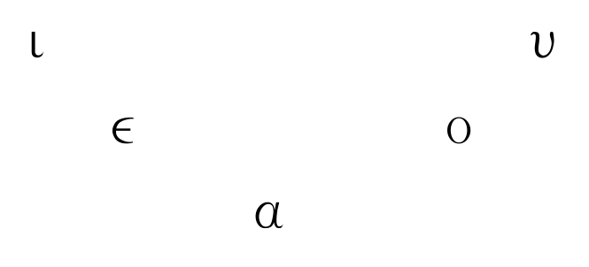
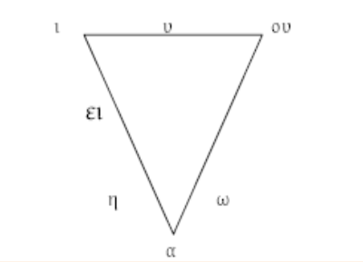

# 2. O sistema vocálico grego

## O sistema vocálico grego

Cando nos referimos ao **sistema fonolóxico** dunha lingua centrámonos nos fonemas, ou sons distintivos, que teñen a capacidade de alterar o significado das palabras. Por exemplo, a diferenza entre ε e η (λέγω vs. λήγω, dicir vs. cesar) é significativa, o que demostra que **ε e η son dous fonemas diferentes**.

Tamén compre facer unha clasificación dos fonemas segundo o seu funcionamento, para pasar despois a estudar as características articulatorias de cada un deles, pois o seu coñecemento facilitaranos a comprensión razoada das diferentes evolucións articulatorias producidas do encontro dos diversos fonemas. Os fonemas do grego poden ser clasificados en tres grupos:

1. **Vogais**: Divididas en breves e longas, con características únicas de articulación.
2. **Sonantes**: Sons vocálicos que funcionan como consonantes en certos contextos.
3. **Consonantes**: Sons que requeren un bloqueo ou restrición do fluxo de aire.

Neste tema, centrarémonos principalmente no primeiro grupo e accesoriamente no segundo.

### Vogais breves

O triángulo das vogais breves ten tres graos de abertura: é igual ao das vogais castellanas. A palatalización de υ, tanto longa como breve, foi unha innovación dalgúns dialectos, particularmente o xónico-ático, o que levou a diversos reaxustes en ambos subsistemas, mais as pronuncias koiné e medieval restableceron o carácter velar desta vogal.

### Vogais longas

En cambio, o das vogais longas ten catro, pois na serie media hai oposición entre aberta e pechada.

Estas vogais longas **ει** e **ου** non deben confundirse cos ditongos ει e ου, aínda que gráficamente se representen da mesma maneira, pois estes tenden a producirse por fenómenos articulatorios que levan á desaparición dalgún elemento intervocálico, por exemplo: λύει < \*λυ-ε-hι < \*λυ-ε-σι < \*λυ-ε-τι (3ª p. sg. pres. ind. act. de λύω).

### Ditongos

Os ditongos son os seguintes:

* **αι, ει, οι**
* **αυ, ευ, ου**
* **υι**

Como vimos antes, tamén había ditongos longos, mais evolucionaron terminando por desaparecer. Qúedamos a **ι** suscrita para marcar graficamente os antigos ditongos longos, aínda que non a pronunciamos (mais en ático clásico si se pronunciaba e escribíase a continuación da vogal longa anterior). Así, atopamos: τῷ λόγῳ, τῇ κεφαλῇ, τῇ ἡμέρᾳ.

Debemos ter en conta que a iota e a ípsilon podían funcionar como consonantes en inicial de palabra e entre vogais; este uso perdeuse en grego clásico, mais fican pegadas da súa existencia. Ademais, a comparación con outras LIE, como o latín, permite comprobar a existencia orixinal destas consonantes en numerosas palabras grergas. A iota consonántica (y), chamada iode, equivalía a *y* castellana, que tamén ten esa función dupla: *ley, leyes, yo* (era unha i moi pechada, como en *hierba/yerba*). Desapareceu moi cedo. Pola súa parte, a ípsilon consonántica, chamada de digamma, funcionaba en inicial de palabra e entre vogais como a *w* actual en inglés ou a *u* de "huevo". Desapareceu en xónico e en ático por volta do VIII ane, mais as inscripcións doutros dialectos conservárona até moito máis tarde.

### Sonantes

Chámanse sonantes aqueles fonemas que poden funcionar como vogais ou como consonantes segundo o contexto fonético. Existían no IE. En grego clásico desapareceron. É fácil advertir a sú aexistencia ao comparar certas palabras coas latinas da mesma raíz ou ao observarmos os resultados dalgunhas desinencias como o acusativo atemático. Neste grupo incluímos os seguintes fonemas:

- **Vogais** --> ι, υ
- **Consonantes**
    - **Líquidas** --> λ, ρ
    - **Nasais** --> μ, ν

[...](https://webpersonal.uma.es/de/JFMARTOS/PDF/LGItema3.pdf)

### As contraccións

Unha contracción é a articulación na mesma sílaba de dúas vogais fortes (ou marcadas, as que poden constituír núcleo silábico nun ditongo) ou de dúas débiles (ou non marcadas, as que non o fai; υι en grego clásico non adoita contraer, senón formar ditongo), que, por asimilación de timbres, se reducen a un só longo (é o fenómeto oposto ao do hiato, que consiste na articulación de dúas vogais consecutivas sen formar unha soa sílaba).

En ático, dialecto particularmente proclive á contracción, existe unha tendencia articulatoria que determina o resultado de todas as contraccións e que pode enunciarse así:

> **Lei da contracción**:
>
> Sendo o resultado dunha contracción sempre unha vogal longa e prevalecendo a maior abertura sobre a menor abertura vocálica, se houber timbre *o*, este prevalecerá; se non o houber, prevalecerá o timbre da primeira vogal.

Vexamos unha serie de exemplos, para o cal cómpre lembrar que

- ε = e breve pechado
- η = e longo aberto
- ο = o breve pechado
- ω = o longo aberto

|      | **α** | **ε** | **η** | **ο** | **ω** |
|:----:|:-----:|:-----:|:-----:|:-----:|:-----:|
|**α** |       |   ᾱ   |   ᾱ   |   ω   |   ω   |
|**ε** |       |   η   |   η   |       |       |
|**η** |   α   |       |       |       |       |
|**ο** |       |       |   ω   |       |       |
|**ω** |       |       |       |   ω   |       |

Agora ben, se as dúas vogais que contraen son pechadas, obviamente o resultado da contracción será unha longa pechada e como o ático carecía dunha notación específica para representar as vogais longas pechadas, tivo que recorrer a unha representación especial para tais fonemas (ει para o e longo pechado e ου para o o longo pechado). Polo demais, séguese a lei da contracción.

|      |**ε** |**ο** |
|:----:|:----:|:----:|
|**ε** |  ει  |  ου  |
|**ο** |  ου  |  ου  |

## Orixe e evolución

## As laringais e a súa pervivencia en grego

Coñécese como laringais un conxunto de tres sons consoantes que aparecen nas reconstrucións da lingua protoindoeuropea (PIE). A teoría foi proposta por primeira vez por Ferdinand de Saussure en 1879; con todo, non obtivo aceptación xeral ata que a lingua hitita foi descuberta e descifrada lentamente a mediados do século XX. Pronto se acharon fonemas na lingua hitita para os que a teoría das laringais constituía a mellor explicación, o que supuxo a aceptación da teoría por parte da maioría dos indoeuropeístas.

### Evidencias das laringais

Non se sospeitou a existencia destes sons até hai relativamente pouco tempo, por seren as linguas anatólicas as únicas linguas indoeuropeas nas que as laringais sobreviviron na escritura. A maioría dos filólogos aceptaron que as laringais existiron, porque, téndoas en conta, se simplifican as explicacións sobre algúns cambios de sons desde PIE ás linguas descendentes que doutro xeito serían bastante difíciles de comprender. Son tres os sons coñecidos como laringais:

- **h1**, a laringal "neutra" (e).
- **h2**, a laringal a-colorante.
- **h3**, a laringal o-colorante.

Winfred P. Lehmann, porén, mantivo que *h1 agrupaba realmente dous sons distintos, debido a reflexos inconsistentes en hitita. (Lehmann asumiu que unha foi unha oclusiva glotal e a outra unha fricativa glotal. Véxase máis abaixo.)

En grego, entre consoantes e ao inicio, **h1** > e, **h2** > a, e **h3** > o. En linguas indoiranias como o sánscrito, toda laringal transfórmase en i, e no resto de linguas indoeuropeas, toda laringal (non inicial) convértese en ***a***. Isto explica o seguinte fenómeno:

- PIE: \*ph2tér; grego **πατήρ** patér; sánscrito **pitá**; latín **pater** (pai).
- PIE: \*ish1ros; grego **ἱερός** hierós; sánscrito **iṣirá** (sagrado).
- PIE: \*dh3tos; grego **δοτός** dotós; latín **datus** (dado).

A evidencia principal da existencia das laringais obsérvase cando en conexión coa vogal do PIE *e-, h2 a colorea en *a-, e h3 en *o-. En anatolio, porén, h2 conservouse, igual que h3 nalgunhas posicións. Por exemplo:

- PIE: \*h2enti; hitita **hanti**; grego **ἀντί** antί; latín **ante** (antes)
- PIE: \*h3eui-; luvita **hawi**; latín **ovis** (ovella)

A teoría das laringais considerouse a mellor explicación á misteriosa aparición de h- no léxico anatolio, e á diferenza vocálica entre as linguas anatolias e a maioría das outras linguas indoeuropeas, como o latín **ovis** = "ovella".

### Efectos nas alternancias vocálicas

A teoría das laringais tamén explica algunhas secuencias de alternancia vocálica (*Αblaut*) que aparecen en moitas raíces indoeuropeas, facendo que parezan menos arbitrarias e máis regulares. Por exemplo, as correspondencias observadas:

- ē/ō/ə explícanse como eh1/oh1/h1;
- ā/ō/ə explícanse como eh2/oh2/h2;
- ō/ō/ə explícanse como eh3/oh3/h3;

### Femininos PIE en -ā

A teoría das laringais require bastantes axustes no modelo flexivo indoeuropeo. O xénero feminino que a maioría das antigas linguas indoeuropeas comparten parece ter sido creado cun sufixo, \*-eh2, que se coloreou por efecto da laringal en \*-a, que á súa vez sufriu un alongamento compensatorio trala perda da laringal. Isto leva a pensar que os nomes e adxectivos femininos tivesen orixinariamente raíces consonánticas, no canto de raíces vocálicas, o que axudaría a explicar a razón pola cal a súa flexión é distinta doutros nomes con raíces vocálicas reais.

Posto que o xénero feminino se formou usando un sufixo recoñecíbel, algúns investigadores pensan que foi unha innovación recente. Segundo o seu punto de vista, o PIE temperán tería só dous xéneros gramaticais orixinais: o animado e o inanimado.

### Evidencias desde as linguas urálicas

Outras evidencias das laringais proveñen das linguas urálicas (fino-ugrias). A pesar de que o protourálico e o protoindoeuropeo non teñen correspondencias fonolóxicas regulares e que non están xeneticamente emparentadas, algunhas palabras reconstruídas en proto-dialectos urálicos (como o proto-fino-ugrio, proto-fino-pérmico etc.) foron tomadas de dialectos indoeuropeos (por exemplo, finés nimi ~ nome e porsas ~ porco). Tras asumir que as laringais protoindoeuropeas poderían traducirse como fonemas guturais nas linguas que tomaron as palabras prestadas, vanse atopando cada vez máis préstamos desde o PIE ás linguas urálicas.

Tres fonemas urálicos aparecen nas posicións onde PIE ten laringais. Desafortunadamente, o urálico, que era máis rico en alveolares, tiña varios fonemas guturais onde elixir. Dependendo da antigüidade do préstamo, aproximáronse a uns ou outros fonemas. Algúns exemplos:* finés lehti (folla) < PIE *bhlh1-to > escandinavo blad 'folla' (aquí non aparece b- inicial porque as linguas urálicas perden o primeiro fonema dun grupo consonántico ao inicio de palabra).

- Finés kal-ja 'cervexa' derivado por sufixación de *kale- < PIE *h2alu- > inglés ale, escandinavo öl (cervexa).
- O finés teh- / teke- (facer) preséntase habitualmente como préstamo de *dheh1- > protoxermánico *do:n (facer), pero esta reconstrución asume que todas as palabras indoeuropeas en urálico son préstamos. Malia que esta asunción non foi criticada abertamente, hai quen propón que podería reconstruírse unha etimoloxía indo-urálica [Kortlandt].

### Valores fonéticos

Aínda existe un considerábel debate acerca da pronuncia das laringais. As evidencias do hitita e o urálico son suficientes para concluír que estes sons foron "guturais" ou pronunciados bastante atrás na cavidade bucal. A mesma evidencia é tamén consistente asumindo que foron sons fricativos (en oposición aos aproximantes ou oclusivos), o que estaría fortemente apoiado polo comportamento das laringais en grupos consonánticos. A suposición de que *h1 é unha oclusiva glotal está aínda moi estendida, se ben, resulta improbábel que unha oclusiva glotal se reflectise como fricativa en préstamos urálicos, como parece ser o caso, por exemplo, na palabra lehti < *lešte < PIE *bhlh1-to. Ademais, todas as laringais seguen o mesmo patrón fonolóxico, dun modo que é bastante diferente das oclusivas protoindoeuropeas, pero similar á fricativa *s.

Se, como indican algunhas probas, existiron dous sons *h1, un podería ter sido a oclusiva glotal e o outro podería ter sido o son h, como en inglés "hat".

Déronse varios argumentos para determinar o lugar exacto da articulación das laringais. En primeiro lugar, o efecto que estes sons tiveron nos fonemas adxacentes está ben documentado. Do que se coñece desta condición fonética por idiomas contemporáneos, sobre todo as linguas semíticas, *h2 (a laringal "a-colorante") podería ter sido unha consoante farínxea fricativa. As fricativas farínxeas (como a letra árabe ح en Muħammad) normalmente causan un coloreado de a nas linguas semíticas (isto ocorre en hebreo, por exemplo). Por esta razón, a suposición de que puidese ter un comportamento farínxeo é bastante forte.

Igualmente está xeralmente asumido que *h3 foi redondeada (labializada) a causa do seu efecto o-colorante. É habitual considerala sonora baseándose na forma de perfecto *pibh3- da raíz *peh3. Utilizando analoxías do árabe , algúns lingüistas supuxeron que *h3 foi tamén farínxea (como a letra árabe ع , como en muعallim = "mestre"), aínda que a suposición de que fose velar é probabelmente máis común. (Os reflexos en linguas urálicas podería ser o mesmo se o fonema orixinal fose velar ou farínxeo.)

O mesmo vese nalgunhas correspondencias entre semita e indoeuropeo, xa sexan debidas a préstamos prehistóricos ou a un devanceiro común (véxase a teoría do nostrático):

  - Grego ὀδύσσομαι odýssomai '(eu) odio' < do PIE *h3-d-w 'odiar'; árabe ع adūw = "inimigo".
  - Grego eólico ἄϝησι awesi '(o vento) sopla' < do PIE *h2-w-h1; árabe ħawā' = "aire".

### Historia da teoría

A historia da xénese da teoría remóntase a un novísimo Saussure que aos 21 anos de idade, en decembro de 1878, publicou a Mémoire sur le système primitif des voyelles dans les langues indo-européenes, que reexaminaba o sistema de Ablaut do latín, grego e sánscrito propoñendo a reconstrución de dous "coeficientes sonánticos" *A e *O (máis tarde *h2 e *h3) para explicar varios casos anómalos de Ablaut e explicar unificadamente o patrón de tres conxugacións verbais do sánscrito. Máis tarde algúns autores retomaron a cuestión e propuxeron un terceiro elemento *E (máis tarde *h1). A dita proposta foi marxinal e non recibiu demasiada atención nos seguintes 50 anos, considerada como unha abstracción de difícil interpretación, aínda que parece que Saussure as pensou como algún tipo de elemento vocálico (non consonántico como suxire a evidencia actualmente dispoñíbel).

Non obstante, en 1927 o erudito polaco Jerzy Kuryłowicz mostrou que en hitita, por aquel entón unha lingua recentemente descifrada, o grafema ḫ aparecía xusto nas posicións para as cales Saussure postulara a presenza de *A. Foi Kuryłowicz quen redesignou os elementos *E, *A e *O como *H1, *H2 e *H3. Dous contribuidores importantes á teoría foran Hermann Möller e Albert Cuny, que non eran indoeuropeístas e cuxa intención ao desenvolver a teoría das laringais era atopar conexións das linguas indoeuropeas coas linguas semíticas, onde existen fonemas laringais (guturais). De feito foi Möller quen propuxera o elemento *E e quen postulara que *A e *O podían ser consoantes e non vogais, baseándose en certos procesos fonolóxicos dos sons guturais en semítico. Tamén foi Möller quen cuñou o termo laringal. Cuny foi quen probou que cando as laringais se atopan con algunha das soantes *r, *l, *m ou *n eran estas as que se transformaban en vogal, polo que *E, *A e *O debían ter un carácter consonántico máis forte que as soantes.

Nos comezos da lingüística indoeuropea as laringais eran un elemento ausente e cara a 1880 case ningún indeoeuropeísta de universidade europea ningunha tería considerado a súa necesidade, excepto por algúns casos marxinais en Alemaña. Sesenta anos máis tarde a situación cambiaría e a teoría laringal considerábase parte importante dos estudos indoeuropeos.

---

- [El sistema fonológico griego](https://webpersonal.uma.es/de/JFMARTOS/PDF/LGItema3.pdf)